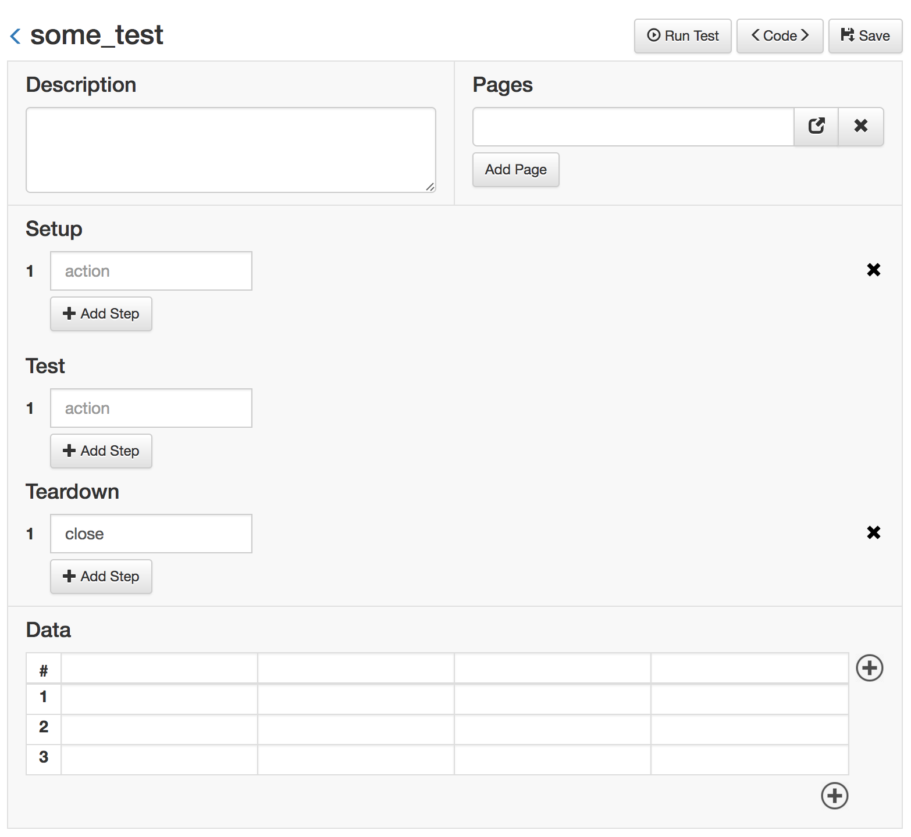
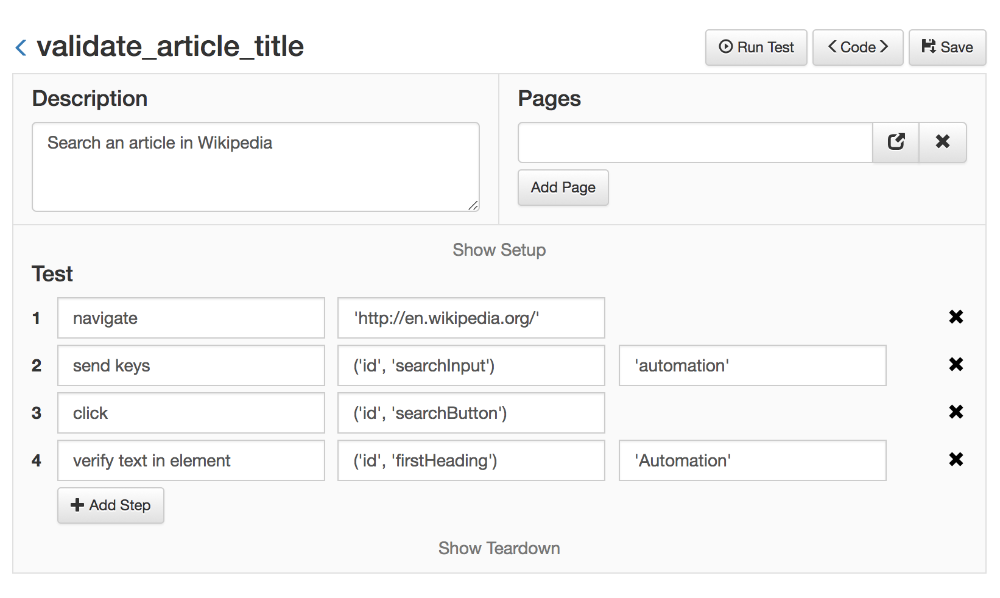

Adding Tests
==================================================

Tests should be placed in the 'tests' folder of a project. You can use more folders to further group and arrange the tests.

##### Add a new test

**Add a new test using the console:**
```
python golem.py createtest <project name> <test name>
```

**Add a test from the Web Module**:


<div class="admonition note">
    <p class="first admonition-title">Note</p>
    <p>It is possible to add folders to the list by appending '/' at the end</p>
</div>

A new test created with either of these options will have the following structure:

```python

description = ''

pages = []

def setup(data):
    pass

def test(data):
    pass

def teardown(data):
    close()

```

And a test as seen with the Web Module has the following structure:



The **description** is used to define the goal of the test and its value is displayed in the generated report, afterwards.

**Pages** is a list of the pages of the application under test that this test will interact with. More about pages later.

After that, a test implements three functions, **setup**, **test** and **teardown**. These functions are always executed in that order.

Use the **setup** function to separate the preconditions from the main test steps.

The **test** method should contain the steps of the test and should have at least one validation at the end.

The **teardown** function is always executed, even if the other functions fail. So use the Teardown function to run final commands needed to set everything back to the original position. It is used most commonly to close the browser.

##### A test example

Next is a bare minimum test that navigates to 'en.wikipedia.org', searches an article and validates that the Title of the article is correct.


**validate_article_title.py**
```python

description = 'Search an article in Wikipedia'

def test(data):
    go_to('http://en.wikipedia.org/')
    send_keys(('id', 'searchInput'), 'ostrich')
    click(('id', 'searchButton'))
    verify_text_in_element(('id', 'firstHeading'), 'Common Ostrich')

def teardown():
    close()

```

And seeing it with the Web Module:



##### Run the test

<div class="admonition note">
    <p class="first admonition-title">Note</p>
    <p>Selenium 3 needs to have the browsers web drivers configured (previously Firefox used to work out of the box but not anymore).
    <p>To learn how to configure the drivers check the <a href="web-drivers.html">Web Drivers page</a>.</p>
</div>

To run the test just press the 'Run Test' button in the Web Module. The test can also be run using the command line with the following command:

```
python golem.py run <project_name> validate_article_title
```


**Golem actions:**

In the previous example, *go_to*, *send_keys*, *click*, and *verify_text...* are Golem actions. Check out [the entire list of actions](actions.html).

<br>

Next, go to [Managing Test Data](managing-test-data.html)
