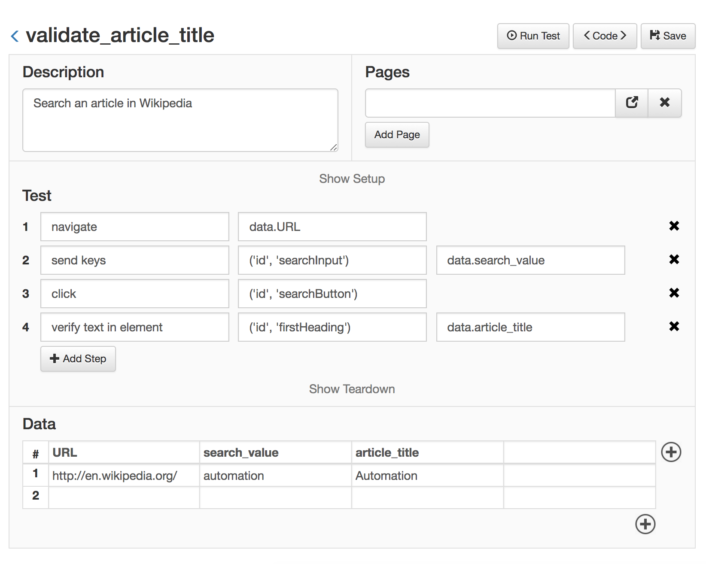

Managing Test Data
==================================================

Keeping the test data (input and output values) properly managed is vital for the success of the automated tests.

To do that, Golem tests can store the data in a separate file.

##### Using the Data Table

Let's rewrite the previous example but extracting all the data values outside of the code:

**validate_article_title.py**
```python

description = 'Search an article in Wikipedia'

def test(data):
    go_to(data.URL)
    send_keys(('id', 'searchInput'), data.search_value)
    click(('id', 'searchButton'))
    verify_text_in_element(('id', 'firstHeading'), data.article_title)

def teardown():
    close()

```

**validate_article_title.csv**

<table>
    <thead>
        <tr>
            <th>URL</th>
            <th>search_value</th>
            <th>article_title</th>
        </tr>
    </thead>
    <tbody>
        <tr>
            <td>http://en.wikipedia.org/</td>
            <td>ostrich</td>
            <td>Common Ostrich</td>
        </tr>
    </tbody>
</table>


With this improvement, we don't have to modify the code each time the test values change. In the case of testing in different environments, we can quickly swap data files without modifying the tests themselves.

With the Web Module, the result is the following:





**Multiple data sets**

What if we need to execute the same test, but with different values each time. That is, the steps of the test are the same, what changes is the data. In that case, with Golem you can add data sets (more rows to the data file) and Golem will automatically execute the same test using all the data sets provided


For example, consider the previous data file, but with added rows:

<table>
    <thead>
        <tr>
            <th>URL</th>
            <th>search_value</th>
            <th>article_title</th>
        </tr>
    </thead>
    <tbody>
        <tr>
            <td>http://en.wikipedia.org/</td>
            <td>ostrich</td>
            <td>Common Ostrich</td>
        </tr>
        <tr>
            <td>http://en.wikipedia.org/</td>
            <td>webdriver</td>
            <td>Selenium (software)</td>
        </tr>
        <tr>
            <td>http://es.wikipedia.org/</td>
            <td>chimichanga</td>
            <td>Chimichanga</td>
        </tr>
        <tr>
            <td>http://fr.wikipedia.org/</td>
            <td>soupe à l'oignon</td>
            <td>Soupe à l'oignon</td>
        </tr>
    </tbody>
</table>

Using that data file, Golem will run the same test 4 times, using each time a different data set.

<div class="admonition note">
    <p class="first admonition-title">Check this out</p>
    <p>In the third and fourth rows we used a different URL, so we can even point the same test to different environments by just changing the data sets.</p>
</div>

Next, go to [Using Page Objects](using-page-objects.html)
