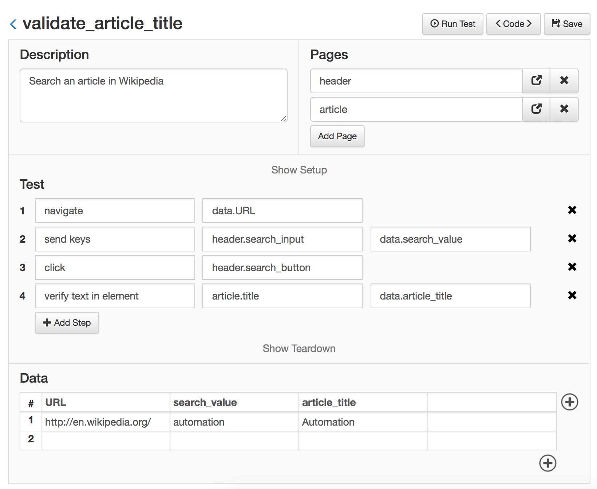

Using Pages
==================================================

If you remember from the previous example, each time the test interacts with a web element (an HTML tag), the selector for that element needs to be declared. That is going to lead only to trouble down the road. 

Imagine what would happen after the application under tests changes. If a selector for a web element changes and that web element is used in hundreds of tests, it will take an huge amount of time to fix.

##### Defining pages

It is a good practice to keep the web element selectors outside of the test, and declared once in a single place. That place should be a **Page Object**.

A Page Object represents an entire page of the application (or a part of a page, like the header or the menu). Inside that Page, you can declare the selectors for all the web elements that your tests are going to interact with. 

You can also define complex actions that the tests can perform inside that page, this take the form of fuctions. More on this later.

Let's see an example, consider the previous test:

**validate_article_title.py**
```python

description = 'Search an article in Wikipedia'

def test(data):
    go_to(data['URL']')
    send_keys(('id', 'searchInput'), data['search_value'])
    click(('id', 'searchButton'))
    verify_text_in_element(('id', 'firstHeading'), data['article_title'])

def teardown():
    close()

```

Let's extract all the selectors and put them inside Pages. For this we create two pages, the first will be the 'header' page, as it's the same header for every page of the application. The second page will be the 'article' page.

**header.py**
```python

search_input = ('id', 'searchInput', 'Search input')

search_button = ('id', 'searchButton', 'Search button')

```

**article.py**
```python

title = ('id', 'firstHeading', 'Title')

```

These pages, as seen with the Web Module, look like this:


##### Using pages inside tests

Having these two pages defined, we can use them in our test, and refactor it as follows:

**validate_article_title.py**
```python

description = 'Search an article in Wikipedia'

pages = ['header', 'article']

def test(data):
    go_to(data['URL']')
    send_keys(header.search_input, data['search_value'])
    click(header.search_button)
    verify_text_in_element(article.title, data['article_title'])

def teardown():
    close()

```

And from the Web Module:



Next, go to [Suites](suites.html)
